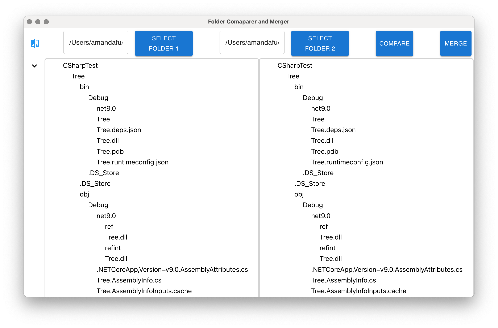

Over time, I ended up with a jungle of folders—some nearly identical, others hiding files that only differed by name. It’s the kind of mess that happens when you keep making **“just-in-case” backups**, **sync across devices**, **download the same thing five times**, or create folders like Final, Final2, and Really_Final_Fixed. Add in a few inherited drives and version chaos, and the clutter really adds up.

This project is my effort to bring order to that chaos. It **compares folders**, helps **move and merge files**, and **deletes duplicates** to clean up messy directories.
Built with **Electron** and **React**, it’s currently a work in progress.

